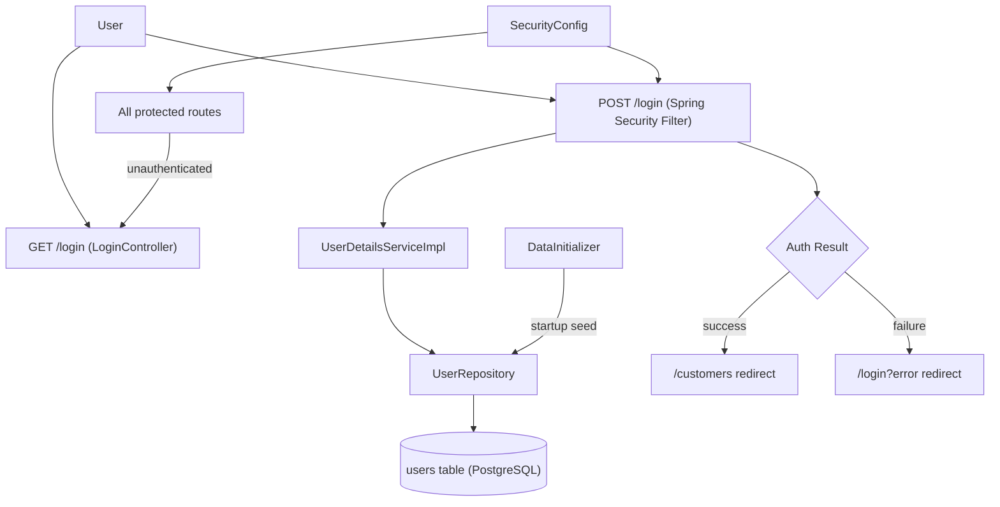

# Technical Specification: F01 - Authentication System

## 1. Technical Overview

**What:** Implement stateful form-based authentication using Spring Security, backed by a PostgreSQL `users` table managed by Flyway. This covers the `SecurityConfig` bean, a `UserDetailsService` implementation, a JPA `User` entity, a `DataInitializer` for bootstrapping default users, a `LoginController` for the login page, and a Thymeleaf login template.

**Why:** F01 is the Foundation feature — it establishes the security layer, database connection, JPA schema, and the secure routing layer that F02, F03, and F04 depend on. Spring Security's form login integrates natively with Thymeleaf via `thymeleaf-extras-springsecurity6` (already on the classpath) and provides session management, CSRF protection, and role-based access control without custom infrastructure.

**Scope:**

Included:
- Login page (`GET /login`) and Spring Security form login filter (`POST /login`)
- Session-based authentication with 2-hour inactivity timeout
- bcrypt password encoding via `BCryptPasswordEncoder`
- Role-based access control (`ADMIN`, `ATTENDANT`)
- Flyway migration creating the `users` table schema
- `DataInitializer` (`ApplicationRunner`) seeding one Admin and one Attendant on first startup, logging plain-text credentials

Excluded:
- User registration or self-service password reset
- User management UI (create/edit/delete users)
- JWT or token-based authentication
- Remember-me / persistent login
- OAuth2 / SSO

## 2. Architecture Impact

**Affected components:**

- `src/main/java/br/com/example/sdd/customers/auth/SecurityConfig.java` — New
- `src/main/java/br/com/example/sdd/customers/auth/UserDetailsServiceImpl.java` — New
- `src/main/java/br/com/example/sdd/customers/auth/User.java` — New
- `src/main/java/br/com/example/sdd/customers/auth/UserRepository.java` — New
- `src/main/java/br/com/example/sdd/customers/auth/DataInitializer.java` — New
- `src/main/java/br/com/example/sdd/customers/auth/LoginController.java` — New
- `src/main/resources/templates/auth/login.html` — New
- `src/main/resources/db/migration/V1__create_users.sql` — New
- `src/main/resources/application.yaml` — Modified



## 3. Technical Decisions

| Decision | Chosen Approach | Alternative Considered | Trade-off |
|----------|----------------|----------------------|-----------|
| Auth mechanism | Spring Security form login with stateful `HttpSession` | JWT/Bearer tokens | Sessions are simpler for Thymeleaf SSR; no client-side token management; works natively with Spring Security's CSRF support |
| Migration tool | Flyway (`V1__create_users.sql`) | Liquibase / JPA `ddl-auto` | Flyway's SQL-first approach is explicit, version-controlled, and auto-runs on startup; simpler than Liquibase for this project size |
| User seeding | `ApplicationRunner` `DataInitializer` logging plain passwords | Flyway seed migration with hardcoded hash | DataInitializer can generate fresh bcrypt hashes at runtime and is easier to adjust per environment; plain-password log aids developer onboarding |
| Primary key | `BIGINT GENERATED BY DEFAULT AS IDENTITY` | UUID | Simpler for an internal system; Spring Boot JPA sequence generation works natively; UUID adds no meaningful benefit here |
| Role representation | `VARCHAR(20)` column mapped to Java `enum Role` | Separate `roles` table | A two-value enum needs no join; the column value is the complete authority; promotes to a table if roles grow |

## 4. Component Overview

**Backend:**

| File Path | New/Modified | Purpose | Key Responsibilities |
|-----------|--------------|---------|---------------------|
| `src/main/java/.../auth/SecurityConfig.java` | New | Spring Security configuration | Configure form login paths, success/failure URLs, session timeout, CSRF, public vs. protected routes, declare `PasswordEncoder` bean |
| `src/main/java/.../auth/UserDetailsServiceImpl.java` | New | `UserDetailsService` implementation | Load `User` by email via `UserRepository`; map `Role` to `GrantedAuthority`; throw `UsernameNotFoundException` for unknown emails |
| `src/main/java/.../auth/User.java` | New | JPA entity | Map `users` table columns; declare `Role` nested enum (`ADMIN`, `ATTENDANT`); use Lombok for boilerplate reduction |
| `src/main/java/.../auth/UserRepository.java` | New | Spring Data JPA repository | Expose `findByEmail(String email): Optional<User>` |
| `src/main/java/.../auth/DataInitializer.java` | New | Startup user seeder | On `ApplicationRunner.run`, check if `users` table is empty; if so, create one `ADMIN` and one `ATTENDANT` with bcrypt-encoded passwords; log both emails and plain-text passwords via `Logger` at `INFO` level |
| `src/main/java/.../auth/LoginController.java` | New | MVC controller | Handle `GET /login`; return `"auth/login"` view name |

**Frontend:**

| File Path | New/Modified | Purpose | Key Responsibilities |
|-----------|--------------|---------|---------------------|
| `src/main/resources/templates/auth/login.html` | New | Login page | Email field; password field with show/hide toggle (client-side JS); submit button with loading-state CSS class on click; conditional error banner when `?error` is present in URL; use Thymeleaf `th:action`, `th:if`, CSRF hidden input |

**Database:**

| Migration File | Tables Affected | Operation | Notes |
|----------------|-----------------|-----------|-------|
| `src/main/resources/db/migration/V1__create_users.sql` | `users` | CREATE | Schema only — no seed data; seeding is the DataInitializer's responsibility |

**Configuration:**

| File | New/Modified | Changes |
|------|-------------|---------|
| `src/main/resources/application.yaml` | Modified | Add `spring.datasource`, `spring.jpa.open-in-view: false`, `spring.flyway.enabled: true`, `server.servlet.session.timeout: 7200s` |
| `build.gradle` | Modified | Add `implementation 'org.flywaydb:flyway-core'` and `runtimeOnly 'org.flywaydb:flyway-database-postgresql'` |

## 5. API Contracts

**Endpoint: Show Login Page**

- **Method:** GET
- **Path:** `/login`
- **Authentication:** None (public)
- **Response:** `200 OK` — renders `auth/login` Thymeleaf view

---

**Endpoint: Process Login (Spring Security native filter)**

- **Method:** POST
- **Path:** `/login`
- **Authentication:** None (public — processed by `UsernamePasswordAuthenticationFilter` before reaching any controller)
- **Content-Type:** `application/x-www-form-urlencoded`

**Request Fields:**

| Field | Type | Required | Description |
|-------|------|----------|-------------|
| `username` | `string` | Yes | User's email address (Spring Security default parameter name) |
| `password` | `string` | Yes | User's plaintext password |
| `_csrf` | `string` | Yes | CSRF token injected by Thymeleaf `th:action` |

**Responses:**

| Outcome | HTTP Status | Redirect | Notes |
|---------|-------------|----------|-------|
| Valid credentials | `302 Found` | `/customers` | Session cookie set |
| Invalid credentials | `302 Found` | `/login?error` | Generic — same message for unknown email and wrong password |
| Empty fields | `302 Found` | `/login?error` | Spring Security treats blank credentials as auth failure |
| Unauthenticated access to any protected route | `302 Found` | `/login` | Spring Security `ExceptionTranslationFilter` |

**Error Codes:**

| Scenario | User-Visible Message |
|----------|----------------------|
| `?error` param present on `/login` | "Invalid email or password" |
| Empty email or password | Field-level HTML5 `required` validation (client-side) |

## 6. Data Model

**Table: `users`**

| Column | Type | Nullable | Default | Description |
|--------|------|----------|---------|-------------|
| `id` | `BIGINT` | No | `GENERATED BY DEFAULT AS IDENTITY` | Primary key |
| `email` | `VARCHAR(255)` | No | — | Unique login identifier |
| `password` | `VARCHAR(255)` | No | — | bcrypt-hashed password (60-char output) |
| `role` | `VARCHAR(20)` | No | — | `ADMIN` or `ATTENDANT` |
| `created_at` | `TIMESTAMPTZ` | No | `NOW()` | Record creation timestamp |

**Indexes:**

| Index Name | Columns | Type | Purpose |
|------------|---------|------|---------|
| `users_pkey` | `id` | btree (PK) | Primary key lookup |
| `users_email_unique` | `email` | btree (UNIQUE) | Prevent duplicate accounts; fast lookup by email on every login |

**Constraints:**

| Constraint | Type | Definition | Purpose |
|------------|------|------------|---------|
| `users_pkey` | PRIMARY KEY | `id` | Unique row identifier |
| `users_email_unique` | UNIQUE | `email` | One account per email address |

**Migration — `V1__create_users.sql`:**

```sql
CREATE TABLE users (
    id         BIGINT       GENERATED BY DEFAULT AS IDENTITY PRIMARY KEY,
    email      VARCHAR(255) NOT NULL,
    password   VARCHAR(255) NOT NULL,
    role       VARCHAR(20)  NOT NULL,
    created_at TIMESTAMPTZ  NOT NULL DEFAULT NOW(),
    CONSTRAINT users_email_unique UNIQUE (email)
);
```

## 7. Testing Strategy

**Test Files:**

| Test File | Test Type | Target | Coverage Goal |
|-----------|-----------|--------|---------------|
| `src/test/.../auth/SecurityConfigTest.java` | Integration (`@SpringBootTest` + Testcontainers) | Route protection and session rules | Public routes accessible, protected routes redirect to login |
| `src/test/.../auth/LoginControllerTest.java` | Integration (`@SpringBootTest` + MockMvc + Testcontainers) | Login page display and auth flow | All credential scenarios and redirect behavior |
| `src/test/.../auth/DataInitializerTest.java` | Integration (`@SpringBootTest` + Testcontainers) | User seeding correctness and idempotency | Correct users created; no duplicates on repeated runs |

**SecurityConfigTest.java:**

| Test Function | Description | Assertions |
|---------------|-------------|------------|
| `unauthenticatedAccessToProtectedRouteRedirectsToLogin` | `GET /customers` without session | `302` → `/login` |
| `loginPageIsPublicAndReturnsOk` | `GET /login` without session | `200 OK` |
| `authenticatedAdminCanAccessProtectedRoute` | `GET /customers` with `ADMIN` session | `200 OK` (or not `302`) |
| `authenticatedAttendantCanAccessProtectedRoute` | `GET /customers` with `ATTENDANT` session | `200 OK` (or not `302`) |
| `logoutInvalidatesSession` | `POST /logout` then `GET /customers` | `302` → `/login` |

**LoginControllerTest.java:**

| Test Function | Description | Assertions |
|---------------|-------------|------------|
| `getLoginReturnsLoginView` | `GET /login` | `200`, view name is `auth/login` |
| `getLoginWithErrorParamShowsErrorMessage` | `GET /login?error` | `200`, response body contains error message text |
| `postLoginWithValidCredentialsRedirectsToCustomers` | `POST /login` with seeded admin credentials | `302` → `/customers` |
| `postLoginWithWrongPasswordRedirectsToError` | `POST /login` with correct email, wrong password | `302` → `/login?error` |
| `postLoginWithUnknownEmailRedirectsToError` | `POST /login` with non-existent email | `302` → `/login?error` |
| `postLoginWithBlankFieldsRedirectsToError` | `POST /login` with empty username/password | `302` → `/login?error` |

**DataInitializerTest.java:**

| Test Function | Description | Assertions |
|---------------|-------------|------------|
| `createsAdminAndAttendantOnEmptyDatabase` | Context loads with empty `users` table | Exactly 2 users created; one has role `ADMIN`, one has role `ATTENDANT`; both passwords pass `BCryptPasswordEncoder.matches` |
| `doesNotCreateDuplicatesWhenUsersAlreadyExist` | Context loads twice (or pre-populated table) | User count remains 2; no `DataIntegrityViolationException` |

**Cross-Feature Integration (from PRD Section 9):**

| Test | Location | Description |
|------|----------|-------------|
| Authenticated session from F01 permits/denies F04 management actions | F04 spec | Verified when F04 is implemented using Spring Security `@WithMockUser` or test login |
