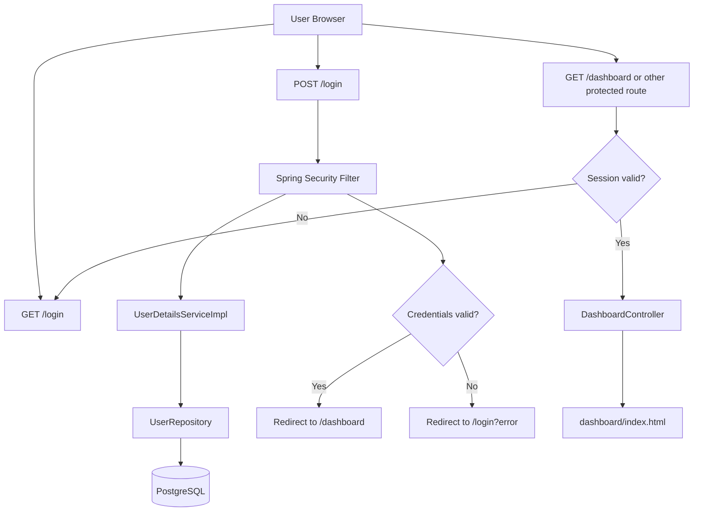

# F01. Authentication System — Technical Specification

## 1. Technical Overview

**What:** Establishes the complete project scaffold (Spring Boot 3.5.x + Gradle), PostgreSQL connection via Spring Data JPA, user domain (entity, repository, service), Spring Security session-based authentication with role-based access control (`ROLE_ADMIN`, `ROLE_ATTENDANT`), and the Thymeleaf login UI with Bootstrap 5 styling.

**Why:** F01 is the Foundation feature. Every other feature in this project depends on the security layer, the JPA setup, and the Thymeleaf/Bootstrap base layout created here. Without this foundation, no protected route, role check, or session context can exist.

**Scope:**

**Included:**
- Project scaffolding: `build.gradle`, `application.properties`, Spring Boot main class
- PostgreSQL data source and JPA/Hibernate configuration
- `User` entity with email, BCrypt-hashed password, and role; `data.sql` seed with two default users
- Spring Security configuration: form login, session management (2-hour timeout, session fixation protection), CSRF, role-based route authorization
- `UserDetailsServiceImpl` that loads users from the database and maps roles to `GrantedAuthority`
- Login page (Thymeleaf + Bootstrap 5): email/password fields, show/hide password toggle, loading feedback on submit, error and logout message display
- Base Thymeleaf layout fragment reused by all feature templates
- Dashboard stub page (protected, accessible to all authenticated roles)
- Redirect to `/login` for any unauthenticated access to protected routes

**Excluded:**
- User self-registration or password reset
- Remember-me / persistent login
- OAuth2 or SSO
- User management UI (not in this feature's scope)

---

## 2. Architecture Impact

**Affected components:**

| Layer | Component | Path |
|-------|-----------|------|
| Build | Gradle config | `build.gradle` |
| Config | Application properties | `src/main/resources/application.properties` |
| Config | Spring Security | `src/main/java/br/com/example/customers/config/SecurityConfig.java` |
| Entry Point | Main class | `src/main/java/br/com/example/customers/CustomersApplication.java` |
| Domain | User entity | `src/main/java/br/com/example/customers/domain/user/User.java` |
| Domain | Role enum | `src/main/java/br/com/example/customers/domain/user/Role.java` |
| Domain | User repository | `src/main/java/br/com/example/customers/domain/user/UserRepository.java` |
| Service | UserDetailsService | `src/main/java/br/com/example/customers/service/UserDetailsServiceImpl.java` |
| Controller | Auth routes | `src/main/java/br/com/example/customers/controller/AuthController.java` |
| Controller | Dashboard route | `src/main/java/br/com/example/customers/controller/DashboardController.java` |
| Template | Base layout | `src/main/resources/templates/layout/base.html` |
| Template | Login page | `src/main/resources/templates/login.html` |
| Template | Dashboard stub | `src/main/resources/templates/dashboard/index.html` |
| Database | Seed data | `src/main/resources/data.sql` |



---

## 3. Technical Decisions

| Decision | Chosen Approach | Alternative Considered | Trade-off |
|----------|----------------|----------------------|-----------|
| Session strategy | Spring Security default `HttpSession` (JSESSIONID cookie) | JWT stateless tokens | Simpler for SSR Thymeleaf apps; requires sticky sessions for multi-node deploy |
| Password hashing | `BCryptPasswordEncoder` strength 10 | Argon2, PBKDF2 | BCrypt is Spring Security's built-in standard; strength 10 balances security and login latency |
| Schema management | `spring.jpa.hibernate.ddl-auto=update` + `data.sql` | Flyway migrations | Simpler for a demo project; Flyway recommended for production |
| Role representation | Single `VARCHAR(20)` column in `users` table | Separate `roles` join table | Sufficient for the two fixed roles (`ADMIN`, `ATTENDANT`) defined in the PRD |

---

## 4. Component Overview

**Backend:**

| File Path | New/Modified | Purpose | Key Responsibilities |
|-----------|--------------|---------|---------------------|
| `build.gradle` | New | Build configuration | Declare Spring Boot 3.5.x plugin; add dependencies: Spring Security, Thymeleaf, `thymeleaf-extras-springsecurity6`, Spring Data JPA, PostgreSQL driver, Lombok, Spring Boot Test |
| `src/main/resources/application.properties` | New | Runtime configuration | DB URL, username, password; `spring.jpa.hibernate.ddl-auto=update`; `server.servlet.session.timeout=2h`; `spring.sql.init.mode=always` |
| `src/main/java/br/com/example/customers/CustomersApplication.java` | New | Spring Boot entry point | `@SpringBootApplication` main class; no additional logic |
| `src/main/java/br/com/example/customers/config/SecurityConfig.java` | New | Spring Security setup | Configure `SecurityFilterChain`: permit `/login`, `/css/**`, `/js/**`; require authentication for all other routes; set `loginPage("/login")`, `defaultSuccessUrl("/dashboard")`; configure logout to redirect to `/login?logout`; set `maximumSessions(1)` and session timeout; enable session fixation protection |
| `src/main/java/br/com/example/customers/domain/user/User.java` | New | JPA entity | `@Entity`, `@Table(name = "users")`; implement `UserDetails`; fields: `id`, `email`, `password`, `role`, `active`, `createdAt`; derive `getAuthorities()` from `role` |
| `src/main/java/br/com/example/customers/domain/user/Role.java` | New | Role enum | Values: `ADMIN`, `ATTENDANT`; used by `User` entity and Spring Security `hasRole()` checks |
| `src/main/java/br/com/example/customers/domain/user/UserRepository.java` | New | Data access | `JpaRepository<User, Long>` with `Optional<User> findByEmail(String email)` |
| `src/main/java/br/com/example/customers/service/UserDetailsServiceImpl.java` | New | Auth bridge | Implement `UserDetailsService`; call `userRepository.findByEmail(username)`; throw `UsernameNotFoundException` if absent; return the `User` entity directly (it implements `UserDetails`) |
| `src/main/java/br/com/example/customers/controller/AuthController.java` | New | Login routes | `GET /login`: return `"login"` view; if already authenticated, redirect to `/dashboard` |
| `src/main/java/br/com/example/customers/controller/DashboardController.java` | New | Dashboard route | `GET /dashboard`: return `"dashboard/index"` view; protected by security config |

**Frontend:**

| File Path | New/Modified | Purpose | Key Responsibilities |
|-----------|--------------|---------|---------------------|
| `src/main/resources/templates/layout/base.html` | New | Base Thymeleaf layout | Bootstrap 5 CDN link and script tags; `<title>` slot; `layout:fragment="content"` insertion point; common navigation bar placeholder |
| `src/main/resources/templates/login.html` | New | Login page | Standalone page (does not extend base layout); Bootstrap 5 centered card; `th:action="@{/login}"` POST form; `th:if="${param.error}"` error alert; `th:if="${param.logout}"` logout alert; show/hide password toggle using inline vanilla JS; submit button disabled and shows spinner via JS on form submit |
| `src/main/resources/templates/dashboard/index.html` | New | Dashboard stub | Extends base layout; displays authenticated user's email and role via `sec:authentication`; placeholder content for F02 customer list |

**Database:**

| File | Tables Affected | Operation | Notes |
|------|-----------------|-----------|-------|
| `src/main/resources/data.sql` | `users` | INSERT | Two seed rows: `admin@example.com` (ADMIN) and `atendente@example.com` (ATTENDANT); `ON CONFLICT (email) DO NOTHING` to be idempotent; BCrypt hashes pre-generated at strength 10 |

---

## 5. API Contracts

This feature uses server-side rendering exclusively. There are no JSON REST endpoints; all interactions are Thymeleaf form submissions and Spring MVC route handlers.

---

**Route: Login Page**
- **Method:** GET
- **Path:** `/login`
- **Authentication:** None (public)
- **Controller:** `AuthController`

| Behavior condition | Result |
|-------------------|--------|
| No query params | Render `login.html` clean |
| `?error` present | Render `login.html` with error alert: "Invalid email or password." |
| `?logout` present | Render `login.html` with info alert: "You have been logged out." |
| User already authenticated | Redirect to `/dashboard` |

---

**Route: Login Submit**
- **Method:** POST
- **Path:** `/login`
- **Authentication:** None (handled by Spring Security filter)
- **Form fields:** `username` (email value), `password`

| Outcome | Redirect |
|---------|----------|
| Credentials valid | `/dashboard` |
| Credentials invalid | `/login?error` |

---

**Route: Logout**
- **Method:** POST
- **Path:** `/logout`
- **Authentication:** Required (valid session, CSRF token)
- **Handled by:** Spring Security `LogoutFilter`
- **On success:** Redirect to `/login?logout`; session invalidated; JSESSIONID cookie cleared

---

**Route: Dashboard**
- **Method:** GET
- **Path:** `/dashboard`
- **Authentication:** Required (any role: `ADMIN` or `ATTENDANT`)
- **Controller:** `DashboardController`

| Behavior condition | Result |
|-------------------|--------|
| Valid session | Render `dashboard/index.html` |
| No session / expired | Redirect to `/login` |

---

## 6. Data Model

**Table: `users`**

| Column | Type | Nullable | Default | Description |
|--------|------|----------|---------|-------------|
| `id` | `BIGSERIAL` | No | auto-increment | Primary key |
| `email` | `VARCHAR(255)` | No | — | Unique login identifier |
| `password` | `VARCHAR(255)` | No | — | BCrypt-hashed password (never plain text) |
| `role` | `VARCHAR(20)` | No | — | `ADMIN` or `ATTENDANT` |
| `active` | `BOOLEAN` | No | `TRUE` | Account enabled flag; `false` locks login |
| `created_at` | `TIMESTAMP` | No | `NOW()` | Record creation timestamp |

**Indexes:**

| Index Name | Columns | Type | Purpose |
|------------|---------|------|---------|
| `pk_users` | `id` | PRIMARY KEY | Row identity |
| `uq_users_email` | `email` | UNIQUE | Enforce unique login; optimize `findByEmail` lookup |

**Constraints:**

| Constraint | Type | Definition | Purpose |
|------------|------|------------|---------|
| `pk_users` | PRIMARY KEY | `id` | Unique row identifier |
| `uq_users_email` | UNIQUE | `email` | One account per email address |
| `chk_users_role` | CHECK | `role IN ('ADMIN', 'ATTENDANT')` | Reject invalid role values at DB level |

**Seed (data.sql):**
```sql
-- Passwords are 'admin123' and 'atendente123' encoded with BCryptPasswordEncoder(10)
INSERT INTO users (email, password, role, active) VALUES
('admin@example.com',      '$2a$10$REPLACE_WITH_GENERATED_HASH', 'ADMIN',     TRUE),
('atendente@example.com',  '$2a$10$REPLACE_WITH_GENERATED_HASH', 'ATTENDANT', TRUE)
ON CONFLICT (email) DO NOTHING;
```
> BCrypt hashes must be generated before committing. Use a one-time runner or `BCryptPasswordEncoder.encode("admin123")` in a scratch test.

---

## 7. Testing Strategy

**Test File Structure:**

| Test File | Test Type | Target | Coverage Goal |
|-----------|-----------|--------|---------------|
| `src/test/java/br/com/example/customers/service/UserDetailsServiceImplTest.java` | Unit | `UserDetailsServiceImpl` | User loading and authority mapping |
| `src/test/java/br/com/example/customers/controller/AuthControllerTest.java` | Integration | Login flow | Login success, failure, redirects, error messages |
| `src/test/java/br/com/example/customers/config/SecurityConfigTest.java` | Integration | Route authorization | Protected and public route access rules |

**UserDetailsServiceImplTest:**

| Test Function | Description | Assertions |
|---------------|-------------|------------|
| `testLoadUserByEmailReturnsUserDetails` | Valid email found in DB | Returns `UserDetails`; `getUsername()` equals email |
| `testLoadUserByEmailThrowsWhenNotFound` | Unknown email | Throws `UsernameNotFoundException` |
| `testAdminRoleMapsToRoleAdminAuthority` | User with role `ADMIN` | `getAuthorities()` contains `ROLE_ADMIN` |
| `testAttendantRoleMapsToRoleAttendantAuthority` | User with role `ATTENDANT` | `getAuthorities()` contains `ROLE_ATTENDANT` |
| `testInactiveUserIsDisabled` | User with `active = false` | `isEnabled()` returns `false` |

**AuthControllerTest:**

| Test Function | Description | Assertions |
|---------------|-------------|------------|
| `testGetLoginPageReturns200` | `GET /login` unauthenticated | Status 200; body contains login form |
| `testLoginWithValidCredentialsRedirectsToDashboard` | `POST /login` with correct credentials | Status 302; redirect to `/dashboard` |
| `testLoginWithInvalidCredentialsRedirectsToLoginError` | `POST /login` with wrong password | Status 302; redirect to `/login?error` |
| `testLoginPageShowsErrorMessageWhenErrorParamPresent` | `GET /login?error` | Status 200; response contains "Invalid email or password" |
| `testLoginPageShowsLogoutMessageWhenLogoutParamPresent` | `GET /login?logout` | Status 200; response contains logout confirmation text |
| `testPasswordNotStoredInPlainText` | Inspect seeded user via `UserRepository` | Stored password starts with `$2a$` |

**SecurityConfigTest:**

| Test Function | Description | Assertions |
|---------------|-------------|------------|
| `testUnauthenticatedAccessToDashboardRedirectsToLogin` | `GET /dashboard` without session | Status 302; redirect location contains `/login` |
| `testAuthenticatedAdminCanAccessDashboard` | `GET /dashboard` with `ROLE_ADMIN` mock user | Status 200 |
| `testAuthenticatedAttendantCanAccessDashboard` | `GET /dashboard` with `ROLE_ATTENDANT` mock user | Status 200 |
| `testLoginPageIsPubliclyAccessible` | `GET /login` without session | Status 200 (not redirected) |
| `testLogoutInvalidatesSession` | `POST /logout` with valid session | Status 302; redirect to `/login?logout`; session invalidated |
