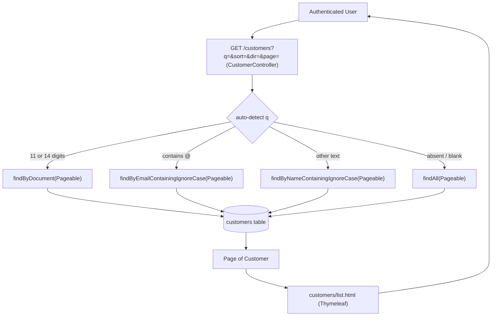

# Technical Specification: F02 - Customer Listing and Search

## 1. Technical Overview

**What:** A server-side rendered customer listing page at `GET /customers` that displays a paginated table of customer records, supports search via a single auto-detecting bar (name partial, CPF/CNPJ exact, email partial), and allows column sorting by Name or Date of Registration. Backed by Spring Data JPA `Pageable` and derived repository finder methods, rendered by Thymeleaf.

**Why:** F02 is the central hub users land on after login — F01's `defaultSuccessUrl` already points to `/customers`. Building it in Wave 2 establishes the `Customer` entity, schema, and repository that F04 (CRUD) will extend. Server-side pagination avoids loading all records into the browser, consistent with the PRD's "less than 3 seconds" retrieval goal at scale.

**Scope:**

Included:
- `GET /customers` — paginated customer list accessible to any authenticated role (ADMIN and ATTENDANT)
- Single search bar with auto-detection: 11- or 14-digit input → CPF/CNPJ exact match; input containing `@` → email partial match; all other input → name partial match (case-insensitive)
- Column sort by Name and Date of Registration (ascending/descending), URL-driven via `sort` and `dir` params
- Pagination controls: Previous, Next, page number links; default page size 20
- Empty state view when no customers match the current query
- Full `customers` table schema defined in this feature's Flyway migration (consumed by F04 for CRUD)

Excluded:
- Customer create, edit, or delete operations (F04)
- Address auto-fill via CEP API (F03)
- Customer detail / view-only page (F04)
- Export to PDF or CSV
- Real-time / server-sent-event list updates

## 2. Architecture Impact

**Affected components:**

- `src/main/java/br/com/example/sdd/customers/customer/Customer.java` — New
- `src/main/java/br/com/example/sdd/customers/customer/CustomerRepository.java` — New
- `src/main/java/br/com/example/sdd/customers/customer/CustomerController.java` — New
- `src/main/resources/templates/customers/list.html` — New
- `src/main/resources/db/migration/V2__create_customers.sql` — New



## 3. Technical Decisions

| Decision | Chosen Approach | Alternative Considered | Trade-off |
|----------|----------------|----------------------|-----------|
| Filtering / pagination / sort | Server-side via URL query params; Spring Data JPA `Pageable` + `Sort` | Client-side JS filtering | Scales to large datasets; bookmark-able URLs; consistent with existing Spring MVC + Thymeleaf SSR pattern |
| Search input UX | Single bar with auto-detection (11/14 all-digit → CPF/CNPJ exact; `@` → email partial; else → name partial) | Dropdown mode selector | Cleaner UI matching the minimal aesthetic of login.html; auto-detection is unambiguous for the three input types |
| Customer table scope | Full schema now — all fields including phone and address — in V2 migration | Listing-only columns in V2, ALTER TABLE in F04 | Avoids schema fragmentation; F04 gets a stable, complete table without DDL changes in a later wave |
| Repository query style | Spring Data JPA derived finder methods (`findByDocument`, `findByNameContainingIgnoreCase`, `findByEmailContainingIgnoreCase`) | JPQL `@Query` or Specifications | Derived methods are type-safe, readable, and sufficient for three fixed search modes; no Specification boilerplate needed |
| Package name | `customer` (singular) | `customers` (plural — collides with root `customers` package) | Avoids the redundant `br.com.example.sdd.customers.customers` path |

## 4. Component Overview

**Backend:**

| File Path | New/Modified | Purpose | Key Responsibilities |
|-----------|--------------|---------|---------------------|
| `src/main/java/.../customer/Customer.java` | New | JPA entity | Map `customers` table; Lombok `@Getter`, `@Setter`, `@NoArgsConstructor`, `@Builder`; all fields including address; `OffsetDateTime createdAt` defaulting to `OffsetDateTime.now()` |
| `src/main/java/.../customer/CustomerRepository.java` | New | Spring Data JPA repository | Extend `JpaRepository<Customer, Long>`; expose `findByDocument(String, Pageable)`, `findByNameContainingIgnoreCase(String, Pageable)`, `findByEmailContainingIgnoreCase(String, Pageable)` |
| `src/main/java/.../customer/CustomerController.java` | New | MVC controller | Handle `GET /customers`; parse and sanitize `q`, `sort`, `dir`, `page` params; validate `sort` against allowlist `{name, createdAt}` defaulting to `createdAt`; auto-detect search mode from `q`; build `PageRequest` with resolved `Sort`; add `page`, `q`, `sort`, `dir` to model; return `"customers/list"` |

**Frontend:**

| File Path | New/Modified | Purpose | Key Responsibilities |
|-----------|--------------|---------|---------------------|
| `src/main/resources/templates/customers/list.html` | New | Customer list page | Search bar `<form method="get">` preserving current `q`; sortable `<th>` links toggling `dir` between `asc`/`desc` while preserving `q` and resetting `page=0`; `<tbody>` rows from `page.content`; empty state section shown when `page.totalElements == 0`; pagination nav with Previous/Next/page-number links preserving `q`, `sort`, `dir`; inline CSS consistent with login.html visual style |

**Database:**

| Migration File | Tables Affected | Operation | Notes |
|----------------|-----------------|-----------|-------|
| `src/main/resources/db/migration/V2__create_customers.sql` | `customers` | CREATE | Full schema including all F04 mandatory fields; no seed data; NOT NULL constraints enforced at DB level |

## 5. API Contracts

**Endpoint: Customer Listing**

- **Method:** GET
- **Path:** `/customers`
- **Authentication:** Required (ADMIN or ATTENDANT role); unauthenticated → 302 to `/login`
- **Content-Type:** `text/html`

**Query Parameters:**

| Parameter | Type | Required | Default | Description |
|-----------|------|----------|---------|-------------|
| `q` | `string` | No | `""` | Search term; auto-detected: 11/14 digits → CPF/CNPJ exact; contains `@` → email partial; else → name partial ILIKE |
| `sort` | `string` | No | `createdAt` | Sort field; accepted values: `name`, `createdAt`; unknown values fall back to default |
| `dir` | `string` | No | `desc` | Sort direction; accepted values: `asc`, `desc`; unknown values fall back to `desc` |
| `page` | `int` | No | `0` | 0-indexed page number |

**Responses:**

| Outcome | HTTP Status | Result |
|---------|-------------|--------|
| Normal list | `200 OK` | Renders `customers/list` view with page model |
| Unauthenticated | `302 Found` | Redirect to `/login` (Spring Security) |
| Invalid sort param | `200 OK` | Falls back to `createdAt desc` default |
| No matching records | `200 OK` | Renders empty state section; `page.totalElements == 0` |

**URL examples:**
```
GET /customers
GET /customers?q=joao&sort=name&dir=asc&page=0
GET /customers?q=12345678901
GET /customers?q=12345678000190
GET /customers?q=joao@email.com
GET /customers?page=2&sort=createdAt&dir=desc
```

**Model attributes exposed to Thymeleaf:**

| Attribute | Type | Description |
|-----------|------|-------------|
| `page` | `Page<Customer>` | Current result page (content, totalPages, number, totalElements, hasNext, hasPrevious) |
| `q` | `String` | Current search term (empty string if absent) |
| `sort` | `String` | Resolved sort field (`name` or `createdAt`) |
| `dir` | `String` | Resolved sort direction (`asc` or `desc`) |

## 6. Data Model

**Table: `customers`**

| Column | Type | Nullable | Default | Description |
|--------|------|----------|---------|-------------|
| `id` | `BIGINT` | No | `GENERATED BY DEFAULT AS IDENTITY` | Primary key |
| `name` | `VARCHAR(255)` | No | — | Customer full name |
| `email` | `VARCHAR(255)` | No | — | Customer email address (unique) |
| `document` | `VARCHAR(14)` | No | — | CPF (11 digits) or CNPJ (14 digits), stored without mask |
| `phone` | `VARCHAR(15)` | No | — | Phone number with DDD, stored without mask |
| `zip_code` | `VARCHAR(9)` | No | — | Brazilian ZIP code (CEP), stored without mask |
| `street` | `VARCHAR(255)` | No | — | Street address |
| `neighborhood` | `VARCHAR(255)` | No | — | Neighborhood |
| `city` | `VARCHAR(255)` | No | — | City |
| `state` | `CHAR(2)` | No | — | Brazilian state abbreviation (e.g., SP, RJ) |
| `created_at` | `TIMESTAMPTZ` | No | `NOW()` | Record creation timestamp |

**Indexes:**

| Index Name | Columns | Type | Purpose |
|------------|---------|------|---------|
| `customers_pkey` | `id` | btree (PK) | Primary key lookup |
| `customers_email_unique` | `email` | btree (UNIQUE) | Prevent duplicate email; used by F04 validation |
| `customers_document_unique` | `document` | btree (UNIQUE) | Prevent duplicate CPF/CNPJ; O(1) exact-match search |

**Constraints:**

| Constraint | Type | Definition | Purpose |
|------------|------|------------|---------|
| `customers_pkey` | PRIMARY KEY | `id` | Unique row identifier |
| `customers_email_unique` | UNIQUE | `email` | One record per email address |
| `customers_document_unique` | UNIQUE | `document` | One record per CPF/CNPJ |

**Migration — `V2__create_customers.sql`:**

```sql
CREATE TABLE customers (
    id           BIGINT       GENERATED BY DEFAULT AS IDENTITY PRIMARY KEY,
    name         VARCHAR(255) NOT NULL,
    email        VARCHAR(255) NOT NULL,
    document     VARCHAR(14)  NOT NULL,
    phone        VARCHAR(15)  NOT NULL,
    zip_code     VARCHAR(9)   NOT NULL,
    street       VARCHAR(255) NOT NULL,
    neighborhood VARCHAR(255) NOT NULL,
    city         VARCHAR(255) NOT NULL,
    state        CHAR(2)      NOT NULL,
    created_at   TIMESTAMPTZ  NOT NULL DEFAULT NOW(),
    CONSTRAINT customers_email_unique    UNIQUE (email),
    CONSTRAINT customers_document_unique UNIQUE (document)
);
```

## 7. Testing Strategy

**Test Files:**

| Test File | Test Type | Target | Coverage Goal |
|-----------|-----------|--------|---------------|
| `src/test/.../customer/CustomerControllerTest.java` | Integration (`@SpringBootTest` + Testcontainers) | `GET /customers` route, model attributes, rendered view | Access control, param parsing, search/sort/pagination result correctness |
| `src/test/.../customer/CustomerRepositoryTest.java` | Integration (`@SpringBootTest` + Testcontainers) | `CustomerRepository` finder methods | Search correctness (name, document, email), pagination, sort ordering |

**CustomerControllerTest.java:**

| Test Function | Description | Assertions |
|---------------|-------------|------------|
| `unauthenticatedAccessRedirectsToLogin` | `GET /customers` without session | `302` → `/login` |
| `authenticatedAdminSeesListView` | `GET /customers` with ADMIN session | `200`, view name `customers/list` |
| `authenticatedAttendantSeesListView` | `GET /customers` with ATTENDANT session | `200`, view name `customers/list` |
| `defaultPageLoads20RecordsMax` | Seed 25 customers, `GET /customers` | `page.content.size()` ≤ 20; `page.totalElements` = 25 |
| `searchByPartialNameFiltersResults` | Seed "João", "Jose", "Maria"; `?q=jo` | Model contains "João" and "Jose"; excludes "Maria" |
| `searchByCpfReturnsExactMatch` | Seed customer with CPF `12345678901`; `?q=12345678901` | `page.totalElements` = 1; result has that document |
| `searchByCnpjReturnsExactMatch` | Seed customer with CNPJ `12345678000190`; `?q=12345678000190` | `page.totalElements` = 1 |
| `searchByEmailFiltersResults` | Seed customer with `joao@example.com`; `?q=joao@example.com` | `page.totalElements` ≥ 1; result includes that customer |
| `searchWithNoMatchReturnsEmptyPage` | `?q=XXXXXXXXXXX` | `page.totalElements` = 0 |
| `sortByNameAscReturnsAlphabeticOrder` | Seed "Zara" and "Ana"; `?sort=name&dir=asc` | "Ana" is first in page content |
| `sortByCreatedAtDescIsDefault` | Seed 2 customers in order; `GET /customers` (no params) | Newest customer appears first |
| `pageParamLoadsCorrectPage` | Seed 25 customers; `?page=1` | `page.number` = 1; content differs from page 0 |

**CustomerRepositoryTest.java:**

| Test Function | Description | Assertions |
|---------------|-------------|------------|
| `findAllPageableReturnsCorrectPageSize` | Save 25 customers; `findAll(PageRequest.of(0, 20))` | `content.size()` = 20; `totalElements` = 25 |
| `findByDocumentReturnsExactMatch` | Save customer with known document; `findByDocument(doc, page)` | Returns exactly that customer |
| `findByNameContainingIgnoreCaseIsPartialAndCaseInsensitive` | Save "João Silva"; `findByNameContainingIgnoreCase("jOãO", page)` | Match returned |
| `findByEmailContainingIgnoreCaseIsPartial` | Save "joao@example.com"; `findByEmailContainingIgnoreCase("@example", page)` | Match returned |
| `findAllSortedByNameAscending` | Save "Zara" and "Ana"; sort by name ASC | "Ana" is `content.get(0)` |
| `findAllSortedByCreatedAtDescending` | Save two customers sequentially; sort by `createdAt` DESC | Newest is `content.get(0)` |

**Assumptions:**

| # | Assumption | Source |
|---|-----------|--------|
| 1 | Server-side pagination, filtering, and sort via URL query params | User confirmed (interview Q1) |
| 2 | Full `customers` table schema in V2 migration | User confirmed (interview Q2) |
| 3 | Single search bar; 11/14 all-digit → CPF/CNPJ exact; contains `@` → email partial; else → name ILIKE | User confirmed auto-detection (interview Q3); email mode derived from PRD "filtering by Name, Email, and Document" |
| 4 | Page size fixed at 20; no user-selectable page size | PRD Capabilities |
| 5 | Sort fields: `name` and `createdAt`; default sort is `createdAt desc` | PRD (Name and Date of Registration) |
| 6 | Clicking a sorted column header flips direction; other params preserved | PRD acceptance criteria |
| 7 | Document, phone, zip_code stored as raw digits (no mask) | Industry standard; F04 applies display masks |
| 8 | All `customers` columns are NOT NULL in the schema; test setup provides all fields when seeding | Full-schema decision; F04 enforces mandatory fields via form validation |
| 9 | Package `customer` (singular) to avoid `customers.customers` name collision | Codebase convention |

**Cross-Feature Integration (from PRD Section 9):**

| Test | Location | Description |
|------|----------|-------------|
| Authenticated session from F01 permits/denies list access | `CustomerControllerTest` | Covered by `unauthenticatedAccessRedirectsToLogin`, `authenticatedAdminSeesListView`, `authenticatedAttendantSeesListView` |
| Selected customer from F02 list opens correctly in F04 detail/edit view | F04 spec | Each row will link to `/customers/{id}`; verified when F04 is implemented |
