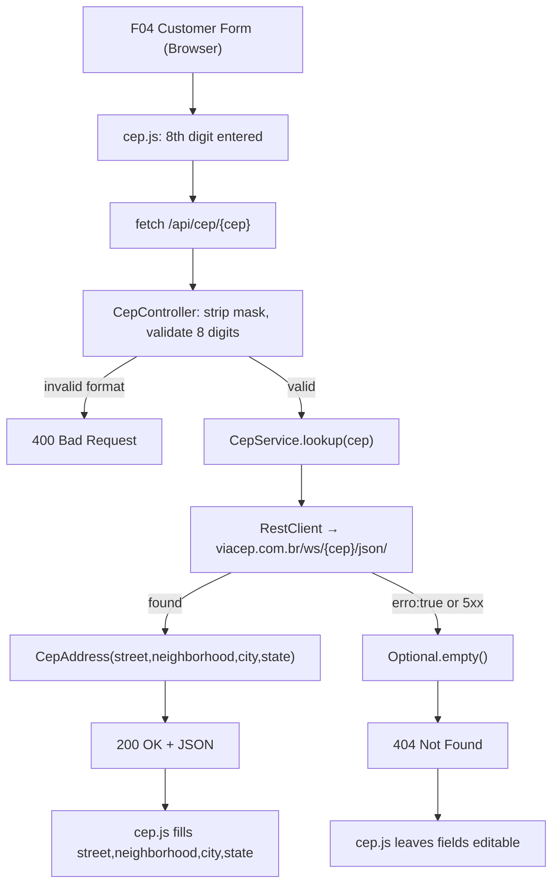

# Technical Specification: F03 - Address Integration (CEP API)

## 1. Technical Overview

**What:** A server-side CEP proxy endpoint (`GET /api/cep/{cep}`) backed by a `CepService` that calls ViaCEP via `RestClient`, paired with a static JavaScript file (`cep.js`) that auto-masks the ZIP code input, triggers the fetch on the 8th digit, shows a spinner, and fills address fields. F03 produces no pages of its own — it delivers a reusable endpoint and JS component consumed by F04's customer form.

**Why:** F04's customer form requires address auto-population to satisfy the PRD goal of 50% reduction in address entry time. Routing the ViaCEP call through a Spring proxy endpoint keeps the external API URL off the frontend, makes the service testable via `MockRestServiceServer` without WireMock, and decouples the frontend from ViaCEP's URL structure. Delivering the JS as a static file (`static/js/`) establishes the project's static asset directory and keeps behavior separate from F04's markup.

**Scope:**

Included:
- `GET /api/cep/{cep}` — authenticated endpoint that proxies ViaCEP and returns structured address JSON
- Auto-detection of masked (`01310-200`) and unmasked (`01310200`) input — mask stripped before forwarding
- Validation of CEP: exactly 8 digits after stripping; 400 if invalid
- 404 response when ViaCEP returns `{"erro": "true"}` or any HTTP error
- `cep.js` — input listener applying 99999-999 mask, triggering fetch at 8th digit, spinner on address fields during loading, fill-on-success / leave-editable-on-failure
- Spring `RestClient` configured with ViaCEP base URL as an injectable bean

Excluded:
- Customer form template (F04)
- Caching CEP responses
- CEP history or analytics
- Support for non-Brazilian address formats

## 2. Architecture Impact

**Affected components:**

- `src/main/java/br/com/example/sdd/customers/cep/CepAddress.java` — New
- `src/main/java/br/com/example/sdd/customers/cep/CepService.java` — New
- `src/main/java/br/com/example/sdd/customers/cep/CepController.java` — New
- `src/main/resources/static/js/cep.js` — New (creates `static/js/` directory)
- `src/test/java/br/com/example/sdd/customers/cep/CepServiceTest.java` — New
- `src/test/java/br/com/example/sdd/customers/cep/CepControllerTest.java` — New



## 3. Technical Decisions

| Decision | Chosen Approach | Alternative Considered | Trade-off |
|----------|----------------|----------------------|-----------|
| CEP lookup origin | Server-side Spring proxy `GET /api/cep/{cep}` calling ViaCEP via `RestClient` | Client-side JS calling ViaCEP directly | Proxy is testable via `MockRestServiceServer`; decouples frontend from external URL; ViaCEP CORS support irrelevant when called server-side |
| HTTP client | `RestClient` (Spring 6.1+ synchronous client) | `RestTemplate` (deprecated), `WebClient` (reactive) | `RestClient` is the recommended synchronous client in Spring Boot 4.x; already on classpath via `spring-webmvc`; no new dependency |
| JS delivery | Static file `src/main/resources/static/js/cep.js` | Inline `<script>` in F04 template | Separates behavior from markup; F04 includes via `<script src="/js/cep.js">`; establishes `static/js/` directory convention |
| Service test approach | `MockRestServiceServer.bindTo(restClient.builder())` — Spring-native HTTP mock | WireMock server, Testcontainers mock server | No new dependency; `MockRestServiceServer` supports `RestClient` via builder binding since Spring 6.1 |
| CEP not-found response | `Optional.empty()` from service → `404 Not Found` from controller | Return empty `CepAddress` with null fields | Semantically accurate; JS clearly distinguishes not-found from success and handles accordingly |
| Security | Falls under existing `anyRequest().authenticated()` rule in `SecurityConfig` | Explicit `permitAll()` for `/api/cep/**` | No `SecurityConfig` changes; endpoint is only called from F04 form where user is already authenticated |
| Package name | `cep` — `br.com.example.sdd.customers.cep` | `address` or `zipcode` | Matches PRD and Brazilian convention for this integration type |

## 4. Component Overview

**Backend:**

| File Path | New/Modified | Purpose | Key Responsibilities |
|-----------|--------------|---------|---------------------|
| `src/main/java/.../cep/CepAddress.java` | New | Response DTO | Java record with fields `street`, `neighborhood`, `city`, `state` (all `String`); serialized as JSON by Spring MVC |
| `src/main/java/.../cep/CepService.java` | New | CEP proxy service | Inject `RestClient` configured with ViaCEP base URL; method `Optional<CepAddress> lookup(String cep)` — calls `GET /ws/{cep}/json/`; maps ViaCEP fields (`logradouro`→`street`, `bairro`→`neighborhood`, `localidade`→`city`, `uf`→`state`); returns `Optional.empty()` if response body contains `"erro": true` or on any HTTP error |
| `src/main/java/.../cep/CepController.java` | New | REST controller | `@GetMapping("/api/cep/{cep}")`; strip `-` from `{cep}` path variable; validate exactly 8 digits (return `400` if invalid); delegate to `CepService.lookup()`; return `200 + CepAddress` JSON if present; return `404` if empty |

**Frontend:**

| File Path | New/Modified | Purpose | Key Responsibilities |
|-----------|--------------|---------|---------------------|
| `src/main/resources/static/js/cep.js` | New | CEP field behavior | Attach `input` listener to the ZIP code field (identified by HTML `id="zipCode"`); extract raw digits with `replace(/\D/g, '')`; apply `NNNNN-NNN` mask when digit count ≥ 5; trigger `fetch('/api/cep/' + digits)` when digit count === 8; show spinner on address fields during request; on 200: fill `#street`, `#neighborhood`, `#city`, `#state`; on 404 or error: remove spinner, leave address fields editable |

**No database migration** — F03 introduces no schema changes. Address columns (`street`, `neighborhood`, `city`, `state`, `zip_code`) were defined in F02's `V2__create_customers.sql`.

## 5. API Contracts

**Endpoint: CEP Lookup Proxy**

- **Method:** GET
- **Path:** `/api/cep/{cep}`
- **Authentication:** Required — any authenticated role (ADMIN or ATTENDANT); covered by existing `anyRequest().authenticated()` rule; unauthenticated → 302 to `/login`
- **Content-Type response:** `application/json`

**Path Parameters:**

| Parameter | Type | Description |
|-----------|------|-------------|
| `cep` | `string` | ZIP code in masked (`01310-200`) or unmasked (`01310200`) format |

**Responses:**

| Outcome | HTTP Status | Body |
|---------|-------------|------|
| Valid CEP, address found | `200 OK` | `CepAddress` JSON |
| Valid CEP, address not found in ViaCEP | `404 Not Found` | empty body |
| CEP format invalid (≠ 8 digits after stripping) | `400 Bad Request` | empty body |
| Unauthenticated | `302 Found` | redirect to `/login` |

**Success response example:**

```json
{
  "street": "Avenida Paulista",
  "neighborhood": "Bela Vista",
  "city": "São Paulo",
  "state": "SP"
}
```

**URL examples:**
```
GET /api/cep/01310200    → 200 with address
GET /api/cep/01310-200   → 200 with address (mask stripped internally)
GET /api/cep/99999999    → 404 (CEP not found in ViaCEP)
GET /api/cep/1234        → 400 (less than 8 digits)
GET /api/cep/ABCDEFGH    → 400 (no digits)
```

**ViaCEP field mapping (internal — CepService):**

| ViaCEP response field | `CepAddress` field |
|-----------------------|-------------------|
| `logradouro` | `street` |
| `bairro` | `neighborhood` |
| `localidade` | `city` |
| `uf` | `state` |
| `"erro": true` | → `Optional.empty()` |

**HTML field ID contract (for `cep.js` ↔ F04 template):**

| Field | Expected HTML `id` |
|-------|--------------------|
| ZIP code input | `zipCode` |
| Street | `street` |
| Neighborhood | `neighborhood` |
| City | `city` |
| State | `state` |

F04's form template must assign these exact IDs to the corresponding inputs. F03's `cep.js` depends on them.

## 6. Data Model

Not applicable — F03 introduces no database changes. Address columns (`street`, `neighborhood`, `city`, `state`, `zip_code`) were defined in `V2__create_customers.sql` (F02). F03 only populates these fields through the browser form at runtime.

## 7. Testing Strategy

**Test Files:**

| Test File | Test Type | Target | Coverage Goal |
|-----------|-----------|--------|---------------|
| `src/test/.../cep/CepServiceTest.java` | Unit — `MockRestServiceServer` (no Spring context) | `CepService.lookup()` | ViaCEP response mapping, not-found handling, network error handling |
| `src/test/.../cep/CepControllerTest.java` | Integration — `@SpringBootTest` + Testcontainers + `@MockitoBean CepService` | `GET /api/cep/{cep}` route | Format validation, mask normalization, JSON response shape, 404, 400, unauthenticated redirect |

**CepServiceTest.java:**

Uses `MockRestServiceServer.bindTo(restClient.builder())` — binds before the `RestClient` is built so all outbound HTTP is intercepted. `CepService` is instantiated directly without a Spring context.

| Test Function | Description | Assertions |
|---------------|-------------|------------|
| `lookupValidCepReturnsMappedAddress` | Mock ViaCEP responds with `{"logradouro":"Av. Paulista","bairro":"Bela Vista","localidade":"São Paulo","uf":"SP",...}`; call `lookup("01310200")` | `Optional.isPresent()` true; `street` = "Av. Paulista"; `neighborhood` = "Bela Vista"; `city` = "São Paulo"; `state` = "SP" |
| `lookupNotFoundCepReturnsEmpty` | Mock ViaCEP responds with `{"erro":"true"}`; call `lookup("00000000")` | `Optional.isEmpty()` true |
| `lookupViaCepServerErrorReturnsEmpty` | Mock ViaCEP responds with HTTP 500; call `lookup("01310200")` | `Optional.isEmpty()` true; no exception thrown to caller |

**CepControllerTest.java:**

`@SpringBootTest` + `@Import(TestcontainersConfiguration.class)` + `@MockitoBean CepService` + MockMvc with `springSecurity()`.

| Test Function | Description | Assertions |
|---------------|-------------|------------|
| `validUnmaskedCepReturnsMappedAddressJson` | `CepService` mocked to return a `CepAddress`; `GET /api/cep/01310200` as authenticated ADMIN | `200 OK`; JSON contains `street`, `neighborhood`, `city`, `state` |
| `validMaskedCepIsNormalizedAndReturns200` | `CepService` mocked to return a `CepAddress`; `GET /api/cep/01310-200` | `200 OK`; controller strips mask and calls service with `"01310200"` |
| `tooShortCepReturns400` | `GET /api/cep/1234` as authenticated user | `400 Bad Request` |
| `nonNumericCepReturns400` | `GET /api/cep/ABCDEFGH` as authenticated user | `400 Bad Request` |
| `nineDigitCepReturns400` | `GET /api/cep/123456789` (9 digits after strip) as authenticated user | `400 Bad Request` |
| `cepNotFoundReturns404` | `CepService` mocked to return `Optional.empty()`; `GET /api/cep/99999999` | `404 Not Found` |
| `unauthenticatedCepRequestRedirectsToLogin` | `GET /api/cep/01310200` with no session | `302` redirect to `/login` |

**Assumptions:**

| # | Assumption | Source |
|---|-----------|--------|
| 1 | CEP lookup proxied through Spring endpoint `GET /api/cep/{cep}` | User confirmed (interview Q1) |
| 2 | JavaScript delivered as `src/main/resources/static/js/cep.js` | User confirmed (interview Q2) |
| 3 | ViaCEP selected as the CEP provider | PRD Capabilities ("ViaCEP or similar") |
| 4 | `RestClient` used as HTTP client; no new dependency required | Spring Boot 4.1.0 (`spring-webmvc` already on classpath) |
| 5 | Service tests use `MockRestServiceServer.bindTo(restClient.builder())`; no WireMock added | Spring 6.1+ built-in; no new test dependency |
| 6 | `/api/cep/**` falls under existing `anyRequest().authenticated()` in `SecurityConfig` — no rule change needed | F01 `SecurityConfig.java` pattern |
| 7 | Trigger fires when raw digit count reaches exactly 8 (extracted via `replace(/\D/g, '')`) | PRD Capabilities: "Automatic trigger when the 8th digit of the ZIP code is entered" |
| 8 | F04's form template must assign these HTML IDs: `zipCode`, `street`, `neighborhood`, `city`, `state` — `cep.js` depends on them | PRD Provides: Structured address data (Street, Neighborhood, City, State) |
| 9 | ViaCEP `{"erro": "true"}` and any HTTP 5xx both map to `Optional.empty()` → `404 Not Found` | PRD Error Handling: "Warning if ZIP code API fails, allowing manual override" |
| 10 | No DB migration needed — address columns already in `V2__create_customers.sql` (F02) | F02 spec: full customers schema in Wave 2 |

**Cross-Feature Integration (from PRD Section 9):**

| Test | Location | Description |
|------|----------|-------------|
| Data fetched by F03 ZIP code API is successfully saved into F04 customer record | F04 spec | `cep.js` fills the form fields; F04's form `POST` persists them to the `customers` table; verified in F04's create-customer integration test |
