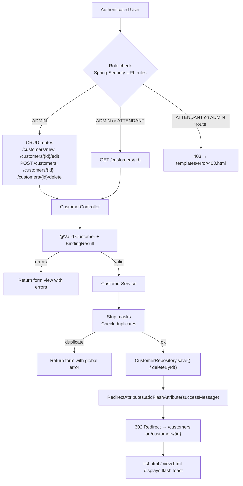

# Technical Specification: F04 - Customer Management (CRUD)

## 1. Technical Overview

**What:** Full CRUD operations for customer records, role-gated by Spring Security — Administrators can create, edit, and delete; Attendants have read-only access to the detail view. Introduces `@ValidDocument` (CPF/CNPJ digit validation), a `CustomerService` for mutation business logic (mask stripping, duplicate detection), three new Thymeleaf templates (`form.html`, `view.html`, `error/403.html`), and modifications to `list.html`, `SecurityConfig`, `Customer`, and `CustomerController`.

**Why:** F02 establishes the customer list and entity; F04 closes the lifecycle by adding mutations. A `CustomerService` separates form-binding from persistence concerns — mask stripping and uniqueness checks belong in the service, not the controller. Role gating at the URL level in `SecurityConfig` follows the F01-established pattern. POST-Redirect-GET for all mutations prevents double-submit on browser refresh.

**Scope:**

Included:
- Customer create (ADMIN only): `GET /customers/new` + `POST /customers`
- Customer detail (all authenticated): `GET /customers/{id}`
- Customer update (ADMIN only): `GET /customers/{id}/edit` + `POST /customers/{id}`
- Customer delete (ADMIN only, physical): `POST /customers/{id}/delete`
- `@ValidDocument` custom Jakarta Validation constraint — CPF (11 digits) and CNPJ (14 digits) digit-check algorithm
- `@NotBlank` and `@Email` on all mandatory fields; `@Size` on bounded string fields
- Mask stripping (document, phone, zip_code) before DB persistence — raw digits stored
- Duplicate email and document detection with user-facing form errors
- POST-Redirect-GET for all mutations; flash attribute `successMessage` on redirect
- Inline HTML/CSS delete confirmation modal with vanilla JS in `form.html`
- Read-only detail page (`view.html`) for Attendants — no Save or Delete controls
- HTTP 403 page via Spring Boot `templates/error/403.html` (auto-served by Spring Boot, no extra controller)
- `isAdmin` boolean added to model on all customer endpoints for conditional UI rendering

Integrated from F03 (not re-implemented here):
- CEP address auto-fill via `cep.js` — `form.html` includes `<script src="/js/cep.js">` and uses the agreed HTML IDs (`zipCode`, `street`, `neighborhood`, `city`, `state`)

Excluded:
- Soft delete or archiving
- Bulk operations
- Customer export (PDF/CSV)
- Audit log or change history

## 2. Architecture Impact

**Modified:**
- `src/main/java/br/com/example/sdd/customers/auth/SecurityConfig.java` — Add ADMIN-only URL rules for mutation routes
- `src/main/java/br/com/example/sdd/customers/customer/Customer.java` — Add Jakarta Validation annotations
- `src/main/java/br/com/example/sdd/customers/customer/CustomerController.java` — Add CRUD handler methods
- `src/main/resources/templates/customers/list.html` — Add "New Customer" button, flash message display, clickable rows
- `src/test/java/br/com/example/sdd/customers/customer/CustomerControllerTest.java` — Add F04 test methods

**New:**
- `src/main/java/br/com/example/sdd/customers/customer/validation/ValidDocument.java`
- `src/main/java/br/com/example/sdd/customers/customer/validation/DocumentValidator.java`
- `src/main/java/br/com/example/sdd/customers/customer/CustomerService.java`
- `src/main/resources/templates/customers/form.html`
- `src/main/resources/templates/customers/view.html`
- `src/main/resources/templates/error/403.html`
- `src/test/java/br/com/example/sdd/customers/customer/validation/DocumentValidatorTest.java`

## 3. Technical Decisions

| Decision | Chosen Approach | Alternative Considered | Trade-off |
|----------|----------------|----------------------|-----------|
| CPF/CNPJ validation | Custom `@ValidDocument` ConstraintValidator | Service-level if/else; caelum-stella library | `@ValidDocument` integrates with Spring MVC's `@Valid` + `BindingResult`; no new dependency; reusable annotation; strips non-digits internally so masked and unmasked inputs both work |
| Toast notifications | `RedirectAttributes.addFlashAttribute("successMessage", "...")` | JS toast library | Purely server-side; no JS dependency; flash attribute survives exactly one POST-Redirect-GET cycle; Thymeleaf renders with `th:if="${successMessage}"` |
| Delete confirmation | Inline HTML/CSS modal with vanilla JS in `form.html` | Two-step server-side confirm page | No extra route or template; consistent with project's no-external-library style; vanilla JS toggles modal visibility |
| Service layer | `CustomerService` for all mutations | Direct repository calls from controller | Controller stays thin; mask stripping and duplicate checks are business logic that belongs in the service; independently testable |
| Route security enforcement | URL-level rules added to `SecurityConfig` | `@PreAuthorize` on each method | Centralized; consistent with F01 pattern; Spring Security intercepts before any controller logic executes |
| 403 UX | Spring Boot `templates/error/403.html` — auto-served for 403 status | Custom `/access-denied` route + controller | Spring Boot auto-discovers `error/403.html`; no additional route, no SecurityConfig change needed |
| Form backing object | `Customer` entity with validation annotations | Separate `CustomerForm` DTO | Sufficient for this CRUD scope; avoids mapping boilerplate; F02 already binds `Customer` in list model |
| Role visibility in templates | `isAdmin` boolean from controller via `model.addAttribute` | Thymeleaf Security extras (`sec:authorize`) | No new dependency; explicit boolean; controller computes once from `Authentication` object |
| Mask stripping location | `CustomerService.create()` and `CustomerService.update()` before `.save()` | `@InitBinder`; controller pre-processing | Service is the right boundary for data normalization; raw digits in DB regardless of input format |
| `@ValidDocument` null handling | Returns `true` for null or blank (delegates null-checking to `@NotBlank`) | Returns `false` for null/blank | Standard Jakarta Validation pattern: each annotation handles its own concern; avoids duplicate error messages |

## 4. Component Overview

**Backend:**

| File Path | New/Modified | Purpose | Key Responsibilities |
|-----------|--------------|---------|---------------------|
| `.../customer/validation/ValidDocument.java` | New | Custom constraint annotation | `@Constraint(validatedBy = DocumentValidator.class)`; targets `FIELD` and `PARAMETER`; message: `"CPF ou CNPJ inválido"` |
| `.../customer/validation/DocumentValidator.java` | New | Constraint implementation | Implements `ConstraintValidator<ValidDocument, String>`; returns `true` for null/empty (deferred to `@NotBlank`); strips all non-digits; branches on length 11 → CPF two-check-digit algorithm; length 14 → CNPJ two-check-digit algorithm; rejects all-same-digit sequences; returns `false` for any other length or invalid check digits |
| `.../customer/Customer.java` | Modified | JPA entity | Add `@NotBlank` on `name`, `email`, `document`, `phone`, `zipCode`, `street`, `neighborhood`, `city`, `state`; `@Email` on `email`; `@Size(max=255)` on `name`, `email`, `street`, `neighborhood`, `city`; `@Size(max=2)` on `state`; `@ValidDocument` on `document` |
| `.../customer/CustomerService.java` | New | Mutation service | `create(Customer form)`: strip masks from `document`/`phone`/`zipCode` via `replaceAll("\\D", "")`, check duplicate `email` and `document`, call `customerRepository.save()`; `update(Long id, Customer form)`: load by ID (throw 404 if absent), strip masks, check duplicates excluding own ID, merge mutable fields, save; `delete(Long id)`: load by ID (throw 404 if absent), call `customerRepository.deleteById(id)` |
| `.../customer/CustomerController.java` | Modified | MVC controller | Add handler methods for all 5 new routes; inject `CustomerService`; bind `@Valid @ModelAttribute Customer customer, BindingResult result`; extract `isAdmin` from `Authentication` and add to model; use `RedirectAttributes` for flash messages; throw `ResponseStatusException(NOT_FOUND)` when customer not found |
| `.../auth/SecurityConfig.java` | Modified | Security rules | Before `anyRequest().authenticated()`, add rules: `GET /customers/new` → ADMIN; `POST /customers` → ADMIN; `GET /customers/*/edit` → ADMIN; `POST /customers/*` → ADMIN; `POST /customers/*/delete` → ADMIN |

**Frontend:**

| File Path | New/Modified | Purpose | Key Responsibilities |
|-----------|--------------|---------|---------------------|
| `.../templates/customers/form.html` | New | Create/edit customer form | `th:action` computed from `customer.id` (null → `POST /customers`; present → `POST /customers/{id}`); fields with agreed HTML IDs (`zipCode`, `street`, `neighborhood`, `city`, `state`, plus `name`, `email`, `document`, `phone`); `th:field` + `th:errors` per field; `th:if="${successMessage}"` toast at top; Delete button shown only when `customer.id != null and isAdmin`, opens inline modal; inline HTML/CSS modal with Confirm (submits hidden form to `POST /customers/{id}/delete`) and Cancel; `<script src="/js/cep.js">` at end of body |
| `.../templates/customers/view.html` | New | Read-only customer detail | Displays all customer field values as plain text; no form inputs; no Save or Delete controls; "Editar" link to `/customers/{id}/edit` shown only when `isAdmin`; "Voltar para lista" link → `/customers`; flash message display |
| `.../templates/customers/list.html` | Modified | Customer list | Add "Novo Cliente" button (`th:if="${isAdmin}"`, links to `/customers/new`) in header; each table row linked to `/customers/{id}`; add `
` flash notification at top of page |
| `.../templates/error/403.html` | New | Access denied page | "Acesso Negado" heading; "Você não tem permissão para acessar esta página." message; "Voltar para lista" link → `/customers`; inline CSS consistent with login.html visual style |

**No database migration** — `V2__create_customers.sql` (defined in F02) already contains the complete `customers` schema. F04 adds only Jakarta Validation annotations to the `Customer` Java class — no DDL changes.

## 5. API Contracts

**Route Table:**

| Method | Path | Handler | Role | Success | Error |
|--------|------|---------|------|---------|-------|
| `GET` | `/customers/new` | `newForm()` | ADMIN | `200` + `customers/form` | `403` |
| `POST` | `/customers` | `create()` | ADMIN | `302` → `/customers` + flash | `200` form errors / `403` |
| `GET` | `/customers/{id}` | `view()` | Any auth | `200` + `customers/view` | `404` |
| `GET` | `/customers/{id}/edit` | `editForm()` | ADMIN | `200` + `customers/form` | `404` / `403` |
| `POST` | `/customers/{id}` | `update()` | ADMIN | `302` → `/customers/{id}` + flash | `200` form errors / `404` / `403` |
| `POST` | `/customers/{id}/delete` | `delete()` | ADMIN | `302` → `/customers` + flash | `404` / `403` |

**Form Fields (POST /customers and POST /customers/{id}):**

| Field | Validation | DB Column | Stored As |
|-------|-----------|-----------|-----------|
| `name` | `@NotBlank`, `@Size(max=255)` | `name` | As-is |
| `email` | `@NotBlank`, `@Email`, `@Size(max=255)` | `email` | As-is |
| `document` | `@NotBlank`, `@ValidDocument` | `document` | Raw digits (mask stripped in service) |
| `phone` | `@NotBlank` | `phone` | Raw digits (mask stripped in service) |
| `zipCode` | `@NotBlank` | `zip_code` | Raw digits (mask stripped in service) |
| `street` | `@NotBlank`, `@Size(max=255)` | `street` | As-is |
| `neighborhood` | `@NotBlank`, `@Size(max=255)` | `neighborhood` | As-is |
| `city` | `@NotBlank`, `@Size(max=255)` | `city` | As-is |
| `state` | `@NotBlank`, `@Size(max=2)` | `state` | As-is |

**Model Attributes (all customer GET endpoints):**

| Attribute | Type | Description |
|-----------|------|-------------|
| `customer` | `Customer` | Empty (new) or populated (view/edit) entity |
| `isAdmin` | `boolean` | True when authenticated user has `ROLE_ADMIN`; computed from `Authentication` in controller |
| `successMessage` | `String` (flash) | Set by redirect after create/update/delete; consumed once by Thymeleaf |

**Redirect targets:**
- After create → `302 /customers`
- After update → `302 /customers/{id}`
- After delete → `302 /customers`

**Flash messages:**
- Create: `"Cliente criado com sucesso."`
- Update: `"Cliente atualizado com sucesso."`
- Delete: `"Cliente excluído com sucesso."`

**Form error messages:**
- Duplicate email: `"E-mail já cadastrado."` (global error added by controller)
- Duplicate document: `"CPF ou CNPJ já cadastrado."` (global error added by controller)
- Invalid CPF/CNPJ: `"CPF ou CNPJ inválido"` (from `@ValidDocument`)
- `@NotBlank` fields: `"Campo obrigatório"`
- `@Email`: `"E-mail inválido"`

**HTML ID contract (required by `cep.js` from F03):**

| Customer Field | Required HTML `id` |
|---------------|-------------------|
| ZIP code input | `zipCode` |
| Street input | `street` |
| Neighborhood input | `neighborhood` |
| City input | `city` |
| State input | `state` |

## 6. Data Model

Not applicable — F04 introduces no database schema changes. The full `customers` table schema (all columns, constraints, indexes) was established in `V2__create_customers.sql` (F02). F04 adds Jakarta Validation annotations to the `Customer` Java entity class only. See F02 spec Section 6 for the complete DDL.

**Mask stripping (service responsibility — raw digits stored in DB):**

| Field | Form Input Format | Stored Format | Strip Pattern |
|-------|------------------|---------------|---------------|
| `document` | `123.456.789-09` or `12.345.678/0001-95` | `12345678909` or `12345678000195` | `replaceAll("\\D", "")` |
| `phone` | `(11) 98765-4321` | `11987654321` | `replaceAll("\\D", "")` |
| `zipCode` | `01310-200` | `01310200` | `replaceAll("\\D", "")` |

## 7. Testing Strategy

**Test Files:**

| Test File | Type | Target | Coverage Goal |
|-----------|------|--------|---------------|
| `.../customer/validation/DocumentValidatorTest.java` | Unit (no Spring context) | `DocumentValidator.isValid()` | CPF/CNPJ algorithm correctness, edge cases, null/blank delegation |
| `.../customer/CustomerControllerTest.java` | Integration (`@SpringBootTest` + Testcontainers) | All 6 CRUD routes | Access control, CRUD happy paths, validation errors, duplicate detection, flash messages |

**DocumentValidatorTest.java:**

| Test Function | Description | Assertion |
|---------------|-------------|-----------|
| `validCpfPassesValidation` | Known valid CPF `"529.982.247-25"` (masked) | `isValid` = true |
| `validCpfUnmaskedPassesValidation` | Same CPF as raw digits `"52998224725"` | `isValid` = true |
| `validCnpjPassesValidation` | Known valid CNPJ `"11.222.333/0001-81"` | `isValid` = true |
| `invalidCpfWrongCheckDigitFails` | Valid CPF with last digit altered | `isValid` = false |
| `invalidCnpjWrongCheckDigitFails` | Valid CNPJ with last digit altered | `isValid` = false |
| `allSameDigitCpfFails` | `"111.111.111-11"` | `isValid` = false |
| `allSameDigitCnpjFails` | `"11.111.111/1111-11"` | `isValid` = false |
| `tooShortDocumentFails` | 10-digit string | `isValid` = false |
| `thirteenDigitStringFails` | 13-digit string (not 11 or 14) | `isValid` = false |
| `nullInputReturnsTrue` | `null` | `isValid` = true (deferred to `@NotBlank`) |
| `emptyStringReturnsTrue` | `""` | `isValid` = true (deferred to `@NotBlank`) |

**CustomerControllerTest.java — F04 additions:**

*Access control:*

| Test Function | Description | Assertion |
|---------------|-------------|-----------|
| `attendantCannotAccessNewCustomerForm` | ATTENDANT `GET /customers/new` | `403` |
| `adminCanAccessNewCustomerForm` | ADMIN `GET /customers/new` | `200`, view `customers/form`, model has `customer` |
| `attendantCannotSubmitNewCustomer` | ATTENDANT `POST /customers` + csrf | `403` |
| `attendantCannotAccessEditForm` | ATTENDANT `GET /customers/{id}/edit` | `403` |
| `attendantCannotUpdateCustomer` | ATTENDANT `POST /customers/{id}` + csrf | `403` |
| `attendantCannotDeleteCustomer` | ATTENDANT `POST /customers/{id}/delete` + csrf | `403` |

*CRUD happy paths:*

| Test Function | Description | Assertion |
|---------------|-------------|-----------|
| `adminCreatesValidCustomerRedirectsToList` | ADMIN `POST /customers` with all valid fields + csrf | `302` to `/customers`; `successMessage` flash set; customer exists in DB |
| `adminViewsCustomerDetailPage` | ADMIN `GET /customers/{id}` (seeded customer) | `200`, view `customers/view`, model `customer` populated, `isAdmin=true` |
| `attendantViewsCustomerDetailWithoutAdminFlag` | ATTENDANT `GET /customers/{id}` | `200`, view `customers/view`, model `isAdmin=false` |
| `adminAccessesEditForm` | ADMIN `GET /customers/{id}/edit` | `200`, view `customers/form`, model `customer` populated |
| `adminUpdatesCustomerRedirectsToDetail` | ADMIN `POST /customers/{id}` with changed `name` + csrf | `302` to `/customers/{id}`; flash set; name updated in DB |
| `adminDeletesCustomerRedirectsToList` | ADMIN `POST /customers/{id}/delete` + csrf | `302` to `/customers`; flash set; customer deleted from DB |
| `viewNonExistentCustomerReturns404` | ADMIN `GET /customers/99999` | `404` |
| `editNonExistentCustomerReturns404` | ADMIN `GET /customers/99999/edit` | `404` |

*Validation errors:*

| Test Function | Description | Assertion |
|---------------|-------------|-----------|
| `createWithInvalidCpfIsRejected` | ADMIN `POST /customers` with `document="111.111.111-11"` + csrf | `200`, view `customers/form`, field error on `document` |
| `createWithInvalidCnpjIsRejected` | ADMIN `POST /customers` with 14-digit invalid CNPJ + csrf | `200`, form errors on `document` |
| `createWithBlankNameIsRejected` | ADMIN `POST /customers` with empty `name` + csrf | `200`, form error on `name` |
| `createWithInvalidEmailIsRejected` | ADMIN `POST /customers` with `email="notanemail"` + csrf | `200`, form error on `email` |
| `createWithDuplicateEmailIsRejected` | Seed customer with email X; ADMIN `POST /customers` same email | `200`, global error containing "E-mail já cadastrado" |
| `createWithDuplicateDocumentIsRejected` | Seed customer with document Y; ADMIN `POST /customers` same document | `200`, global error containing "CPF ou CNPJ já cadastrado" |

**Assumptions:**

| # | Assumption | Source |
|---|-----------|--------|
| 1 | CPF/CNPJ validation via custom `@ValidDocument` ConstraintValidator; no new dependency | User confirmed (interview Q1) |
| 2 | Toast notifications via `RedirectAttributes.addFlashAttribute("successMessage", ...)` | User confirmed (interview Q2) |
| 3 | Delete confirmation via inline HTML/CSS modal with vanilla JS | User confirmed (interview Q3) |
| 4 | Package `customer` (singular) — `br.com.example.sdd.customers.customer` | F02 spec (established) |
| 5 | `CustomerService` introduced for F04 mutations; F02 was read-only (no service layer was needed then) | Business logic complexity warrants separation |
| 6 | `@ValidDocument` strips non-digits internally — accepts both masked and raw digit input | Enables validation before mask stripping in service |
| 7 | `@ValidDocument` returns `true` for null/empty — defers to `@NotBlank` | Standard Jakarta Validation convention |
| 8 | Document, phone, zip_code stored as raw digits — masks stripped in `CustomerService` before save | F02 spec assumption 7 |
| 9 | `isAdmin` boolean added to model for conditional template rendering — avoids Thymeleaf Security extras dependency | No new dependency |
| 10 | Spring Boot auto-serves `templates/error/403.html` for HTTP 403 responses — no controller needed | Spring Boot error-handling convention |
| 11 | POST-Redirect-GET on all mutations (create, update, delete) to prevent double-submit | Industry standard for Spring MVC form handling |
| 12 | `form.html` uses the agreed HTML IDs from F03 spec (`zipCode`, `street`, `neighborhood`, `city`, `state`) for `cep.js` compatibility | F03 spec Section 5 (HTML field ID contract) |
| 13 | `CustomerService` throws `ResponseStatusException(HttpStatus.NOT_FOUND)` when customer not found by ID | Consistent with Spring MVC exception-to-HTTP-status convention |
| 14 | `CustomerRepository` requires two new derived methods: `existsByEmail(String)` and `existsByDocument(String)` for create duplicate checks | Spring Data JPA derived queries |
| 15 | For update path, `CustomerRepository` requires `existsByEmailAndIdNot(String, Long)` and `existsByDocumentAndIdNot(String, Long)` to exclude own ID from uniqueness check | Standard update duplicate check pattern |

**Cross-Feature Integration (from PRD Section 9):**

| Test | Location | Description |
|------|----------|-------------|
| Authenticated session from F01 correctly permits or denies F04 management actions | `CustomerControllerTest` | Covered by access control tests — ADMIN allowed, ATTENDANT blocked on mutation routes |
| Selected customer from F02 list opens correctly in F04 detail/edit view | `CustomerControllerTest` | `adminViewsCustomerDetailPage` and `adminAccessesEditForm` — seed customer via repository, access by ID |
| Data fetched by F03 ZIP code API is successfully saved into F04 customer record | `CustomerControllerTest` | `adminCreatesValidCustomerRedirectsToList` — POST form data including address fields as if pre-populated by cep.js; assert customer persisted with correct street/neighborhood/city/state |
