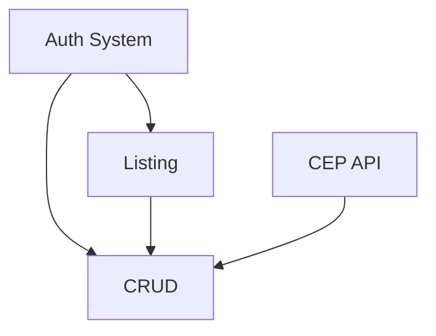

# Gestão de Clientes

## 1. Executive Summary

Gestão de Clientes is a specialized management system designed to centralize and simplify the lifecycle of customer data. The platform provides a streamlined CRUD (Create, Read, Update, Delete) interface that allows organizations to maintain accurate and up-to-date information about their client base, serving as a single source of truth for administrative and support teams.

The product is tailored for businesses that require a secure and efficient way to handle customer records without the complexity of a full-scale CRM. By focusing on core data management, the system ensures high usability for daily operations. It operates through a web-based interface where authorized personnel can quickly search, filter, and manage client profiles, backed by robust security measures to protect sensitive data.

The core value of Gestão de Clientes lies in its ability to transform disorganized customer information into a structured, searchable, and secure asset. It eliminates the risks associated with manual spreadsheet management, such as data inconsistency and unauthorized access, while improving operational speed through features like automated address lookup via ZIP code integration and granular permission controls.

## 2. Problem and Opportunity

**The Problem**
*   **Data Fragmentation and Inconsistency**
    *   Customer data stored in disparate spreadsheets leads to "multiple versions of the truth."
    *   Manual entry errors result in invalid contact details and incorrect addresses.
    *   Lack of centralized history makes it difficult to track the latest updates to a client's record.
*   **Security and Access Risks**
    *   Spreadsheets are easily copied, leaked, or modified by unauthorized personnel.
    *   No trail of who accessed or modified sensitive client information.
    *   Lack of standardized password protection for internal data management.
*   **Operational Inefficiency**
    *   Time wasted searching for specific clients through large, unoptimized lists.
    *   Manual typing of full addresses increases data entry time by up to 40%.
    *   No clear separation of duties between managers and support staff.

**The Opportunity**
*   **Centralized Source of Truth** - Gestão de Clientes solves fragmentation by providing a single database where all records are validated and synchronized in real-time.
*   **Agile Data Entry** - The ZIP code (CEP) API integration directly addresses entry errors and speed, automating address completion and ensuring standardized formatting.
*   **Role-Based Security** - By implementing strict Admin/Attendant roles and encrypted authentication, the system transforms data access from a liability into a secure, audited process.
*   **Optimized Retrieval** - Advanced filtering and pagination allow users to handle thousands of records with the same speed as a dozen, significantly reducing operational friction.

## 3. Target Audience

### Primary Users

**Administrator**
*   Needs full control over the customer database to maintain data integrity.
*   Responsible for auditing records and performing sensitive operations like deletions.
*   Requires a high-efficiency interface for bulk updates and complex data management.

**Attendant**
*   Needs quick access to client information to support daily business operations.
*   Requires read-only access to verify client details without the risk of accidental modification.
*   Relies on robust search and filtering to find client records while interacting with customers.

### Behavioral Profile
Internal employees who value system stability and speed. They are familiar with web interfaces and require a tool that minimizes repetitive typing and provides clear feedback on success or failure.

## 4. Objectives

**Product Objectives**
*   **Centralize** all customer records into a single, secure web platform.
*   **Automate** address data entry to reduce manual typing errors.
*   **Secure** access to sensitive client data through role-based permissions.
*   **Optimize** data retrieval speed for large volumes of client records.

**Success Metrics**
*   **100%** of customer records stored in the centralized system rather than spreadsheets.
*   **Less than 3 seconds** to retrieve any client record using search or filters.
*   **50% reduction** in address entry time through ZIP code API integration.
*   **Zero** unauthorized data modifications by non-admin users.

## 5. User Stories

### F01. Authentication System
*   As a user, I want to log in with my email and password so that I can access the system securely.
*   As the system, I want to encrypt all user passwords so that credentials remain protected in the event of a database breach.

### F02. Customer Listing and Search
*   As a user, I want to view a paginated list of customers so that the system remains fast even with thousands of records.
*   As a user, I want to search for customers by name or CPF/CNPJ so that I can find a specific profile quickly.
*   As a user, I want to filter and sort the list by available fields so that I can organize the view according to my current task.

### F03. Address Integration (CEP API)
*   As a user, I want to enter a ZIP code and have the street, neighborhood, city, and state filled automatically so that I save time and avoid typos.
*   As a user, I want to manually edit address fields if the API is unavailable or returns incomplete data.

### F04. Customer Management (CRUD)
*   As an Administrator, I want to register, edit, and delete customers so that I can keep the database accurate.
*   As an Attendant, I want to view customer details so that I can fulfill my support duties without modifying data.
*   As a user, I want to receive clear success or error messages after any data operation so that I know the state of my request.

## 6. Functionalities

### F01. Authentication System

**Provides:**
*   Authenticated session context (used by F02, F04)

**Capabilities:**
*   Login via unique email and password.
*   Mandatory password hashing using bcrypt or equivalent industry standard.
*   Session timeout after 2 hours of inactivity.

**Experience:**
*   Clean login screen with email and password fields.
*   Visual feedback during authentication (loading state).
*   Masked password input with "show password" toggle.

**Error Handling:**
*   Generic error message for failed login (e.g., "Invalid email or password") to prevent user enumeration.
*   Validation message for empty fields.
*   Redirection to login page if an unauthenticated user tries to access internal routes.

### F02. Customer Listing and Search

**Consumes:**
*   F01: Authenticated session context

**Capabilities:**
*   Paginated view with a default of 20 records per page.
*   Search functionality supporting Name (partial match) and CPF/CNPJ (exact match).
*   Ordering by Name or Date of Registration (ascending/descending).
*   Client-side or Server-side filtering by Name, Email, and Document.

**Experience:**
*   Data table with headers and sortable columns.
*   Search bar at the top of the list.
*   Pagination controls (Previous, Next, Page Numbers) at the bottom.
*   Empty state illustration when no customers match the search/filter criteria.

### F03. Address Integration (CEP API)

**Provides:**
*   Structured address data: Street, Neighborhood, City, State (used by F04)

**Capabilities:**
*   Integration with ViaCEP or similar public Brazilian ZIP code API.
*   Automatic trigger when the 8th digit of the ZIP code is entered.
*   Support for the 99999-999 and 99999999 formats.

**Experience:**
*   ZIP code field with auto-masking.
*   Visual indicator (spinner) while fetching data from the API.
*   Address fields (Street, Neighborhood, City, State) transition from "loading" to "filled" or remain editable if not found.

### F04. Customer Management (CRUD)

**Consumes:**
*   F01: Authenticated session context for permission checking
*   F03: Structured address data for form pre-filling

**Core Scope:**
*   Full CRUD for Administrators.
*   Read-only access for Attendants.
*   Validation for CPF/CNPJ (format and digit validation).
*   Mandatory fields: Name, Email, Document, Phone, Address.

**Capabilities:**
*   Support for both CPF (11 digits) and CNPJ (14 digits) validation.
*   Phone number masking (support for 8 and 9 digit numbers).
*   Permanent deletion of records (Physical deletion).

**Experience:**
*   Form view for creation and editing.
*   "View-only" mode for Attendants where inputs are disabled.
*   Confirmation modal before any deletion.
*   Success "Toast" notifications after Save/Update/Delete actions.

**Error Handling:**
*   Validation error if CPF/CNPJ is invalid or already exists in the system.
*   Validation error for malformed email addresses.
*   Warning if the ZIP code API fails, allowing manual override.
*   Access Denied screen if an Attendant tries to access a "Create" or "Edit" URL directly.

## 7. Out of Scope

*   **Customer Communication:** No built-in email or SMS sending functionality.
*   **External Integrations:** No synchronization with external CRM or ERP systems (except the ZIP code API).
*   **Reporting:** No advanced dashboard, charts, or export to PDF/Excel in this version.
*   **Self-Service:** No portal for customers to view or edit their own data.
*   **Soft Deletion:** Records are physically removed; no "Recycle Bin" functionality.

## 8. Dependency Graph

| # | Feature | Priority | Dependencies |
|---|---------|----------|--------------|
| F01 | Authentication System | 1 | None |
| F02 | Customer Listing and Search | 1 | F01 |
| F03 | Address Integration (CEP API) | 2 | None |
| F04 | Customer Management (CRUD) | 1 | F01, F02, F03 |

### Foundation Features
These features set up shared project infrastructure. In a greenfield project they must be implemented sequentially before or alongside any feature that depends on them:
*   **F01 Authentication System** — Establishes the framework scaffolding, database connection, user schema, and the secure routing layer.

### Execution Waves
Features within the same wave can be built in parallel. A wave starts only after every feature in earlier waves is complete.

**Note:** Foundation features (see "Foundation Features" above) cannot run in parallel in a greenfield project even if they appear together in a wave — they share scaffolding files and must be implemented sequentially until the base is in place.

*   **Wave 1**: F01, F03
*   **Wave 2**: F02
*   **Wave 3**: F04

### Priority levels
*   **1** = Essential — product does not work without it
*   **2** = Important — significant value addition
*   **3** = Desirable — incremental improvement

## 9. Acceptance Criteria

### F01. Authentication System
*   [ ] User can log in with a valid email and password combination.
*   [ ] System rejects login attempts with incorrect credentials and displays a generic error message.
*   [ ] Passwords are not stored in plain text in the database (verified via db inspection).
*   [ ] Unauthenticated users are redirected to the login page when trying to access `/dashboard`.

### F02. Customer Listing and Search
*   [ ] The list displays a maximum of 20 customers per page by default.
*   [ ] Searching for a valid CPF returns the exact matching customer.
*   [ ] Searching for a partial name (e.g., "John") returns all customers containing that string.
*   [ ] Clicking on a column header (e.g., Name) sorts the list accordingly.

### F03. Address Integration (CEP API)
*   [ ] Entering a valid ZIP code (e.g., 01310-200) automatically populates Street, Neighborhood, City, and State.
*   [ ] The address fields remain editable if the API returns a 404 or fails to connect.
*   [ ] ZIP code field accepts both "01310200" and "01310-200" inputs.

### F04. Customer Management (CRUD)
*   [ ] Administrators can successfully create, update, and delete customer records.
*   [ ] Attendants can see customer details but the "Save" and "Delete" buttons are hidden or disabled.
*   [ ] System rejects saving a customer with an invalid CPF/CNPJ format.
*   [ ] A confirmation dialog appears before a record is permanently deleted.

### Cross-Feature Integration
*   [ ] Authenticated session from F01 correctly permits or denies access to F04 management actions.
*   [ ] Selected customer from the F02 list opens correctly in the F04 detail/edit view.
*   [ ] Data fetched by the F03 ZIP code API is successfully saved into the F04 customer record.
